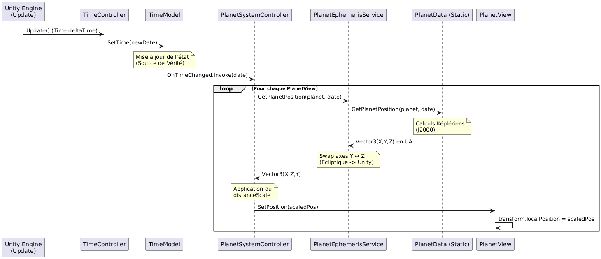
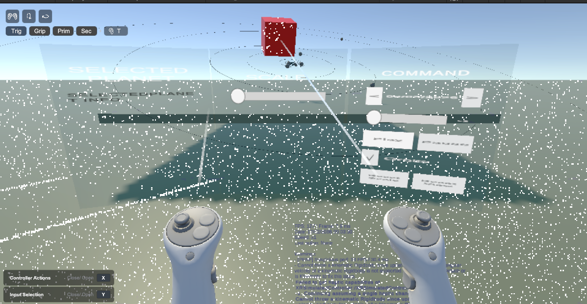
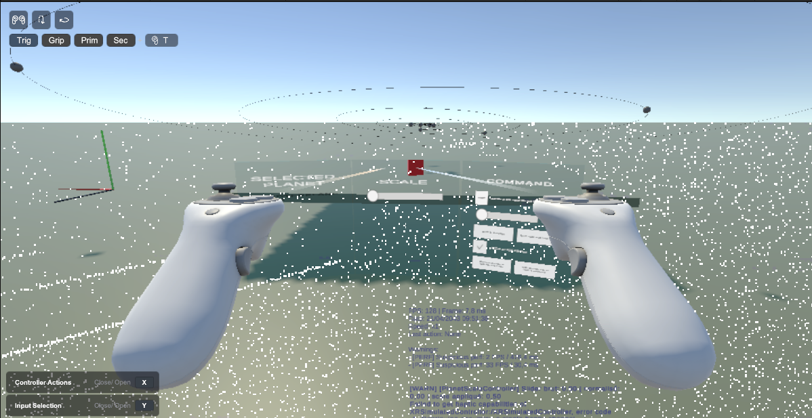
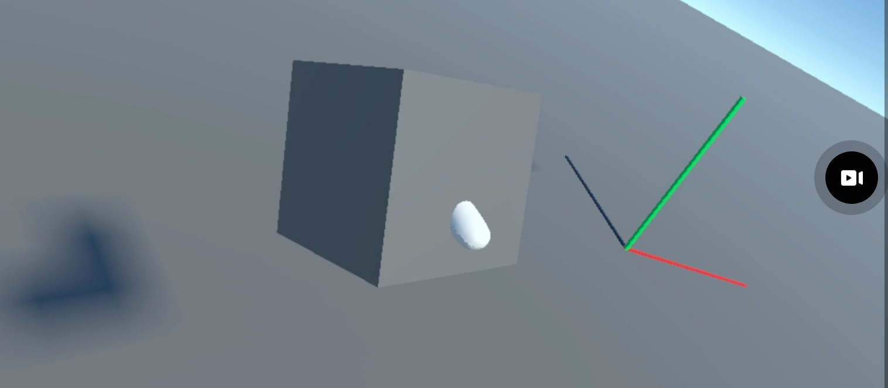
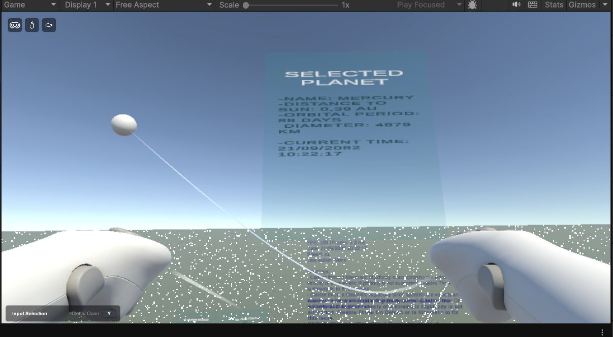

# TP XR Engineering — Simulateur du Système Solaire en VR

Simulation interactive du système solaire en réalité virtuelle, développée avec **Unity** et le framework **XR Interaction Toolkit** (Meta Quest / OpenXR). Le projet met en œuvre une architecture **MVC stricte** (Model-View-Controller) avec une couche Service et un point d'entrée centralisé (Composition Root).

---

## Sommaire

1. [Présentation du projet](#présentation-du-projet)
2. [Architecture MVC](#architecture-mvc)
3. [Couche Model](#couche-model)
4. [Couche View](#couche-view)
5. [Couche Controller](#couche-controller)
6. [Couche Service](#couche-service)
7. [Bootstrap — Point d'entrée](#bootstrap--point-dentrée)
8. [Flux de données](#flux-de-données)
9. [Structure des fichiers](#structure-des-fichiers)
10. [Configuration](#configuration)

---

## Présentation du projet

L'application propose une visualisation immersive du système solaire en VR. Les positions des 8 planètes (Mercure à Neptune) sont calculées en temps réel à partir d'**éphémérides képléniennes** précises (NASA JPL). L'utilisateur peut :

- Observer les orbites planétaires animées en temps accéléré
- Déplacer et orienter le système solaire entier via un handle XR saisissable
- Mettre à l'échelle le système via un slider
- Contrôler la simulation (play/pause, date, vitesse) depuis un panneau de commande VR
- Sélectionner une planète pour afficher ses informations astronomiques et déclencher un focus caméra
- Suivre l'état de l'application via un overlay de debug temps réel

## Flux TimeModel->Controller->PlanetView et Captures du projet

- Flux TimeModel->Controller->PlanetView

<p align="center">
  
</p>

Ce diagramme illustre comment une mise à jour du temps dans Unity se propage à travers tes classes pour aboutir au déplacement physique d'une planète.
Le flux du système suit une chaîne de mise à jour déclenchée par le **TimeModel**, qui centralise la date et notifie ses abonnés lors d’un changement. Le **PlanetSystemController** reçoit cette nouvelle valeur et orchestre la mise à jour des astres en déléguant le calcul des positions au **PlanetEphemerisService**. Ce service transforme la date en coordonnées 3D adaptées au repère d’Unity, puis la **PlanetView** applique la position mise à l’échelle au `transform`, mettant ainsi à jour le rendu des planètes.

- Captures de l'application via XR simulator : Vue d'ensemble
<p align="center">
  
</p>

<p align="center">
  
</p>

- Captures de l'application via mode miroir : Grab du handle
<p align="center">
  
</p>

- Captures de l'application via XR simulator : Sélection de planète
<p align="center">
  
</p>

---

## Architecture MVC

Le projet applique un **MVC pur** : aucune couche ne connaît les détails d'implémentation d'une autre. La communication se fait exclusivement par **événements C#** (`event Action`) et **interfaces**.

```
┌─────────────────────────────────────────────────────────────┐
│                      AppBootstrapper                        │
│              (Composition Root — câblage unique)            │
└────────┬──────────────┬─────────────────┬───────────────────┘
         │              │                 │
    ┌────▼────┐   ┌──────▼──────┐   ┌─────▼──────┐
    │  Model  │   │  Controller │   │    View    │
    │         │◄──│             │──►│            │
    │TimeModel│   │PlanetSystem │   │PlanetView  │
    │PlanetData│  │TimeController│  │SolarSystem │
    │SSConfig │   │FocusCtrl    │   │CommandPanel│
    └────┬────┘   │ScaleCtrl    │   │HandleObs   │
         │        │TransformCtrl│   └────────────┘
         │        │CommandPanel │
         │        └──────┬──────┘
         │               │
         │        ┌──────▼──────┐
         │        │   Service   │
         └───────►│ Ephemeris   │
                  │ Service     │
                  └─────────────┘
```

**Principe de séparation :**

| Couche | Responsabilité | Type C# |
|--------|---------------|---------|
| **Model** | État de l'application, règles métier, événements | Classes C# pures |
| **View** | Rendu Unity, interaction XR, émission d'événements UI | `MonoBehaviour` |
| **Controller** | Réaction aux événements, orchestration Model↔View | Classes C# pures `IDisposable` |
| **Service** | Calculs algorithmiques indépendants | Classes C# pures |
| **Bootstrap** | Instanciation et câblage de toutes les couches | `MonoBehaviour` unique |

---

## Couche Model

### `TimeModel`
[Assets/Scripts/Models/TimeModel.cs](Assets/Scripts/Models/TimeModel.cs)

Modèle central de la simulation temporelle. C'est une **classe C# pure** (sans dépendance Unity) qui encapsule l'état du temps simulé.

```
TimeModel
├── CurrentTime : DateTime       — date courante de la simulation
├── TimeScale   : float          — facteur d'accélération du temps
├── IsPlaying   : bool           — état play/pause
├── OnTimeChanged : event Action<DateTime>  — notifie à chaque tick
├── SetTime(DateTime)            — met à jour la date et émet l'événement
├── SetScale(float)              — modifie la vitesse de simulation
├── Play()                       — reprend la simulation
└── Pause()                      — met en pause
```

Ce modèle est le **cœur réactif** de l'application : tout changement de date déclenche automatiquement la mise à jour des positions planétaires via l'événement `OnTimeChanged`.

---

### `PlanetData`
[Assets/Scripts/Models/PlanetData.cs](Assets/Scripts/Models/PlanetData.cs)

Classe statique contenant les **paramètres képlériens** des 8 planètes et l'algorithme de résolution de l'**équation de Kepler** par méthode itérative.

- Planètes supportées : Mercury, Venus, Earth, Mars, Jupiter, Saturn, Uranus, Neptune
- Paramètres par planète : demi-grand axe `a`, excentricité `e`, inclinaison `I`, longitude moyenne `L`, longitude du périhélie, longitude du nœud ascendant, et termes correctifs `b`, `c`, `s`, `f` pour les planètes externes
- Référentiel : J2000 (1er janvier 2000), coordonnées en **unités astronomiques (UA)**
- Résolution de l'anomalie excentrique `E` par convergence itérée (précision : 10⁻⁶ degrés)

---

### `SolarSystemConfig`
[Assets/Scripts/Models/SolarSystemConfig.cs](Assets/Scripts/Models/SolarSystemConfig.cs)

**ScriptableObject** de configuration globale, éditable depuis l'Inspector Unity sans recompilation.

```
SolarSystemConfig (ScriptableObject)
├── distanceScale     : float   — facteur de mise à l'échelle des distances
├── planetSizeScale   : float   — taille relative des sphères planétaires
├── showOrbits        : bool    — affichage des trajectoires orbitales
├── minScale / maxScale         — plage de l'échelle globale du système
├── positionSensitivity         — sensibilité du handle de déplacement
├── rotationSensitivity         — sensibilité du handle de rotation
└── planets[] : PlanetInfo[]    — métadonnées astronomiques des 8 planètes
      └── displayName, distanceToSunAU, orbitalPeriodDays, diameterKm
```

---

## Couche View

Toutes les Views sont des `MonoBehaviour`. Elles **ne contiennent aucune logique métier** : elles exposent uniquement des méthodes de manipulation et des événements.

---

### `SolarSystemView`
[Assets/Scripts/Views/SolarSystemView.cs](Assets/Scripts/Views/SolarSystemView.cs)

Vue racine du système solaire. Expose des primitives de transformation pour l'ensemble du système.

```
SolarSystemView (MonoBehaviour)
├── GetInitialPose() / InitializeInitialPose()
├── GetPosition() / SetPosition(Vector3)
├── GetRotation() / SetRotation(Quaternion) / ApplyRotation(Quaternion)
└── SetUniformScale(float)
```

---

### `PlanetView`
[Assets/Scripts/Views/PlanetView.cs](Assets/Scripts/Views/PlanetView.cs)

Vue d'une planète individuelle. Gère sa position locale dans l'espace du système solaire et le rendu de son orbite via un `LineRenderer`.

```
PlanetView (MonoBehaviour)
├── planet : PlanetData.Planet   — identifiant de la planète
├── SetPosition(Vector3)         — position locale (dans le repère parent)
├── GetPosition() / SetRotation() / GetRotation()
├── SetUniformScale(float)
└── DrawOrbit(Vector3[])         — trace la trajectoire via LineRenderer
                                    (coordonnées corrigées par rapport à la position courante)
```

---

### `CommandPanelView`
[Assets/Scripts/Views/CommandPanelView.cs](Assets/Scripts/Views/CommandPanelView.cs)

Panneau de commande VR avec boutons, slider et toggle. Expose des **événements C#** purs, sans aucune logique métier.

```
CommandPanelView (MonoBehaviour)
│
├── Événements émis vers le Controller :
│   ├── DateChanged   : event Action<DateTime>
│   ├── SpeedChanged  : event Action<int>
│   ├── PlayClicked   : event Action
│   ├── PauseClicked  : event Action
│   ├── OrbitsToggled : event Action<bool>
│   ├── ResetScaleClicked : event Action
│   └── ResetViewClicked  : event Action
│
└── Méthodes de synchronisation (appelées par le Controller) :
    ├── SetDate(DateTime)
    ├── SetSpeed(int)
    └── SetOrbitsToggle(bool)
```

---

### `TransformRealtimeObserver` (Handle)
[Assets/Scripts/Views/Handle/HandleManager.cs](Assets/Scripts/Views/Handle/HandleManager.cs)

Observer XR sur un `XRGrabInteractable`. Détecte les mouvements du handle physique saisi par le contrôleur VR et émet les **deltas de transformation** en temps réel.

```
TransformRealtimeObserver (MonoBehaviour + XRGrabInteractable)
│
├── Événements :
│   ├── OnTablePositionOffsetChanged : event Action<Vector3>     — delta de position
│   └── OnTableRotationOffsetChanged : event Action<Quaternion>  — delta de rotation
│
└── Comportement :
    ├── En Update() : compare position/rotation courante avec la dernière frame
    ├── Émet le delta si seuil dépassé (> 0.001 m ou > 0.1°)
    └── Au relâcher : retourne à sa pose initiale (handle "ressort")
```

---

### Autres Views

| Classe | Rôle |
|--------|------|
| `SliderManager` | Slider UI XR exposant `OnValueChanged`, `Value`, `MinValue`, `MaxValue` |
| `PlanetSelectable` | Composant sur chaque planète gérant la sélection XR |
| `FocusInfoView` / `BoardFocusView` / `XRFocusView` | Vues de la carte d'information lors du focus planète |
| `DebugOverlay` | Overlay de debug temps réel : FPS, date simulée, vitesse, dernière action, warnings |

---

## Couche Controller

Tous les controllers sont des **classes C# pures** (sans `MonoBehaviour`) qui implémentent `IDisposable`. Ils s'abonnent aux événements dans leur constructeur et se désabonnent dans `Dispose()`, garantissant l'absence de fuites mémoire.

---

### `TimeController`
[Assets/Scripts/Controllers/TimeController.cs](Assets/Scripts/Controllers/TimeController.cs)

Unique `MonoBehaviour` parmi les controllers. Son rôle est d'injecter le temps Unity (`Time.deltaTime`) dans le `TimeModel`.

```
TimeController (MonoBehaviour)
├── Init(TimeModel, DebugOverlay)
└── Update() → si IsPlaying : CurrentTime += deltaTime × secondsPerDay
                              → TimeModel.SetTime() → déclenche OnTimeChanged
```

`secondsPerDay` définit l'accélération temporelle (100 par défaut = 1 seconde réelle = 100 jours simulés).

---

### `PlanetSystemController`
[Assets/Scripts/Controllers/PlanetSystemController.cs](Assets/Scripts/Controllers/PlanetSystemController.cs)

Orchestre le positionnement de toutes les planètes. S'abonne à `TimeModel.OnTimeChanged`.

```
PlanetSystemController (IDisposable)
│
├── Construction :
│   ├── S'abonne à TimeModel.OnTimeChanged
│   ├── ApplyPlanetScale() → applique config.planetSizeScale à toutes les PlanetView
│   └── BuildPlanetOrbits() → calcule 5000 points (pas de 30 jours) et envoie à DrawOrbit()
│
└── HandleTimeChanged(DateTime) :
    └── Pour chaque planète → EphemerisService.GetPlanetPosition() × distanceScale
                            → PlanetView.SetPosition()
```

---

### `PlanetTransformController`
[Assets/Scripts/Controllers/HandleController.cs](Assets/Scripts/Controllers/HandleController.cs)

Traduit les mouvements du handle XR en transformations du système solaire.

```
PlanetTransformController (IDisposable)
│
├── S'abonne à TransformRealtimeObserver.OnTablePositionOffsetChanged
│            et OnTableRotationOffsetChanged
│
├── HandlePositionChanged(Vector3 offset) :
│   └── SolarSystemView.SetPosition(current + offset × positionSensitivity)
│
├── HandleRotationChanged(Quaternion delta) :
│   └── SolarSystemView.ApplyRotation(amplifiedDelta)   [filtrage NaN sur l'axe]
│
└── resetViewPose() :
    └── Restaure la pose initiale enregistrée au démarrage
```

---

### `PlanetScaleController`
[Assets/Scripts/Controllers/ScaleController.cs](Assets/Scripts/Controllers/ScaleController.cs)

Pilote l'échelle globale du système via le slider VR.

```
PlanetScaleController (IDisposable)
│
├── S'abonne à SliderManager.OnValueChanged
│
└── Scale(float sliderValue) :
    ├── Normalise la valeur brute du slider [minSlider, maxSlider] → [0, 1]
    ├── Interpole dans la plage [config.minScale, config.maxScale]
    └── SolarSystemView.SetUniformScale(targetScale)
```

---

### `CommandPanelController`
[Assets/Scripts/Controllers/CommandPanelController.cs](Assets/Scripts/Controllers/CommandPanelController.cs)

Pont entre le panneau de commande VR et le reste de l'application.

```
CommandPanelController (IDisposable)
│
├── S'abonne à tous les événements de CommandPanelView
│
├── HandleDateChanged    → TimeModel.SetTime()
├── HandleSpeedChanged   → TimeModel.SetScale()
├── HandlePlayClicked    → TimeModel.Play()
├── HandlePauseClicked   → TimeModel.Pause()
├── HandleOrbitsToggled  → config.showOrbits = value
├── HandleResetScaleClicked → PlanetScaleController.Scale(1)
└── HandleResetViewClicked  → PlanetTransformController.resetViewPose()
```

---

### `PlanetFocusController`
[Assets/Scripts/Controllers/FocusController.cs](Assets/Scripts/Controllers/FocusController.cs)

Gère le focus sur une planète sélectionnée en VR : pause du temps, repositionnement de la caméra, affichage des informations.

```
PlanetFocusController (IDisposable)
│
├── S'abonne à PlanetSelectionEmitter.PlanetSelected / PlanetDeselected
│
├── HandlePlanetSelected(PlanetView) :
│   ├── TimeModel.Pause()
│   ├── SaveCurrentState()       — sauvegarde poses caméra, board, planète
│   ├── FocusCameraAbovePlanet() — déplace le XR Origin face à la planète
│   ├── PlaceBoardAndPlanetForFocus() — positionne board et planète face caméra
│   └── UpdateBoardText()        — affiche nom, distance AU, période, diamètre
│
└── HandlePlanetDeselected(PlanetView) :
    ├── RestorePreviousState()   — restaure toutes les poses sauvegardées
    └── TimeModel.Play()
```

---

## Couche Service

### `IPlanetEphemerisService`
[Assets/Scripts/Services/IPlanetEphemerisService.cs](Assets/Scripts/Services/IPlanetEphemerisService.cs)

Interface de calcul de position planétaire. Permet de découpler le controller du moteur de calcul.

```csharp
public interface IPlanetEphemerisService
{
    Vector3 GetPlanetPosition(PlanetData.Planet planet, DateTime date);
}
```

### `PlanetEphemerisService`
[Assets/Scripts/Services/PlanetEphemerisService.cs](Assets/Scripts/Services/PlanetEphemerisService.cs)

Implémentation concrète. Délègue le calcul à `PlanetData` et applique la **permutation d'axes Y/Z** pour correspondre au repère Unity (Y = haut) depuis le repère astronomique (Z = nord écliptique).

```csharp
// Repère astronomique → Repère Unity
return new Vector3(p.x, p.z, p.y);
```

---

## Bootstrap — Point d'entrée

### `AppBootstrapper`
[Assets/Scripts/Bootstrap/AppBootstrapper.cs](Assets/Scripts/Bootstrap/AppBootstrapper.cs)

**Composition Root** unique de l'application. Ce `MonoBehaviour` est le seul endroit où toutes les dépendances sont instanciées et câblées. Aucun controller ne crée lui-même ses dépendances.

```
AppBootstrapper.Start()
│
├── 1. new TimeModel()
├── 2. new PlanetEphemerisService()
│
├── 3. AddComponent<TimeController>().Init(timeModel)
│
├── 4. new PlanetSystemController(timeModel, ephemeris, planets[], config)
├── 5. new PlanetTransformController(observer, solarSystemView, config)
├── 6. new PlanetScaleController(solarSystemView, config, scaleSlider)
├── 7. new CommandPanelController(commandPanelView, timeModel, config,
│                                 scaleController, transformController)
├── 8. new PlanetFocusController[](selectionEmitters[], boardView,
│                                  textView, cameraFocusManager, config, timeModel)
└── 9. DebugOverlay.Init(timeModel)

AppBootstrapper.OnDestroy()
└── Dispose() sur tous les controllers → désabonnement propre des événements
```

---

## Flux de données

### Simulation du temps (boucle principale)

```
Update() [TimeController]
    → TimeModel.SetTime(current + deltaTime × secondsPerDay)
        → OnTimeChanged?.Invoke(newDate)
            → PlanetSystemController.HandleTimeChanged(date)
                → EphemerisService.GetPlanetPosition(planet, date)
                    → PlanetData.GetPlanetPosition() [calcul képlérien]
                → PlanetView.SetPosition(pos × distanceScale)
```

### Manipulation du handle VR

```
Utilisateur saisit le handle [XRGrabInteractable]
    → TransformRealtimeObserver.Update() détecte le delta
        → OnTablePositionOffsetChanged?.Invoke(offset)
            → PlanetTransformController.HandlePositionChanged()
                → SolarSystemView.SetPosition()
```

### Panneau de commande VR

```
Utilisateur appuie sur Play [CommandPanelView]
    → PlayClicked?.Invoke()
        → CommandPanelController.HandlePlayClicked()
            → TimeModel.Play()
```

### Focus planète

```
Utilisateur sélectionne une planète [PlanetSelectionEmitter]
    → PlanetSelected?.Invoke(planetView)
        → PlanetFocusController.HandlePlanetSelected()
            → TimeModel.Pause()
            → CameraFocusManager.FocusCamera(position, rotation)
            → BoardView.SetPose() + PlanetView.SetPosition()
            → TMPTextView.SetText(infos astronomiques)
```

---

## Structure des fichiers

```
Assets/Scripts/
│
├── Bootstrap/
│   └── AppBootstrapper.cs          — Composition Root
│
├── Models/
│   ├── TimeModel.cs                — État temporel + événement OnTimeChanged
│   ├── PlanetData.cs               — Paramètres képlériens + calcul de position
│   └── SolarSystemConfig.cs        — ScriptableObject de configuration globale
│
├── Views/
│   ├── SolarSystemView.cs          — Vue racine du système solaire
│   ├── PlanetView.cs               — Vue d'une planète + orbite
│   ├── CommandPanelView.cs         — Panneau de commande VR
│   ├── SliderManager.cs            — Slider de mise à l'échelle
│   ├── PlanetSelectable.cs         — Composant de sélection XR sur planète
│   ├── FocusInfoView.cs            — Affichage informations focus
│   ├── BoardFocusView.cs           — Tableau d'information focus
│   ├── XRFocusView.cs              — Gestionnaire focus caméra XR
│   └── Handle/
│       ├── HandleManager.cs        — TransformRealtimeObserver (handle XR)
│       └── ScaleSliderManager.cs   — Slider de scale XR
│
├── Controllers/
│   ├── TimeController.cs           — Pilote TimeModel depuis Update()
│   ├── PlanetSystemController.cs   — Orbites + positions planétaires
│   ├── HandleController.cs         — Déplacement/rotation via handle XR
│   ├── ScaleController.cs          — Mise à l'échelle via slider
│   ├── FocusController.cs          — Focus caméra sur planète sélectionnée
│   ├── CommandPanelController.cs   — Contrôle depuis le panneau VR
│   └── DebugOverLay.cs             — Overlay de debug temps réel
│
└── Services/
    ├── IPlanetEphemerisService.cs  — Interface de calcul d'éphémérides
    └── PlanetEphemerisService.cs   — Implémentation (délègue à PlanetData)

Assets/Scenes/
├── Boot.unity                      — Scène de démarrage
└── TP_XrEng.unity                  — Scène principale
```

---

## Configuration

### SolarSystemConfig (ScriptableObject)

Créer via le menu Unity : `Assets > Create > XR > Solar System Config`

| Paramètre | Valeur par défaut | Description |
|-----------|:-----------------:|-------------|
| `distanceScale` | `0.4` | Facteur de compression des distances interplanétaires |
| `planetSizeScale` | `0.2` | Taille des sphères planétaires (non proportionnelle à la réalité) |
| `showOrbits` | `true` | Affichage des trajectoires |
| `minScale` | `0.5` | Échelle minimale du système (slider) |
| `maxScale` | `3.0` | Échelle maximale du système (slider) |
| `positionSensitivity` | `1.0` | Multiplicateur des déplacements via handle |
| `rotationSensitivity` | `1.0` | Multiplicateur des rotations via handle |

### TimeController

| Paramètre | Valeur par défaut | Description |
|-----------|:-----------------:|-------------|
| `secondsPerDay` | `100` | Nombre de jours simulés par seconde réelle |

### Vitesses disponibles (CommandPanelView)

Le panneau de commande propose trois paliers de vitesse : **×1**, **×10**, **×100**, sélectionnables via un slider discret.
